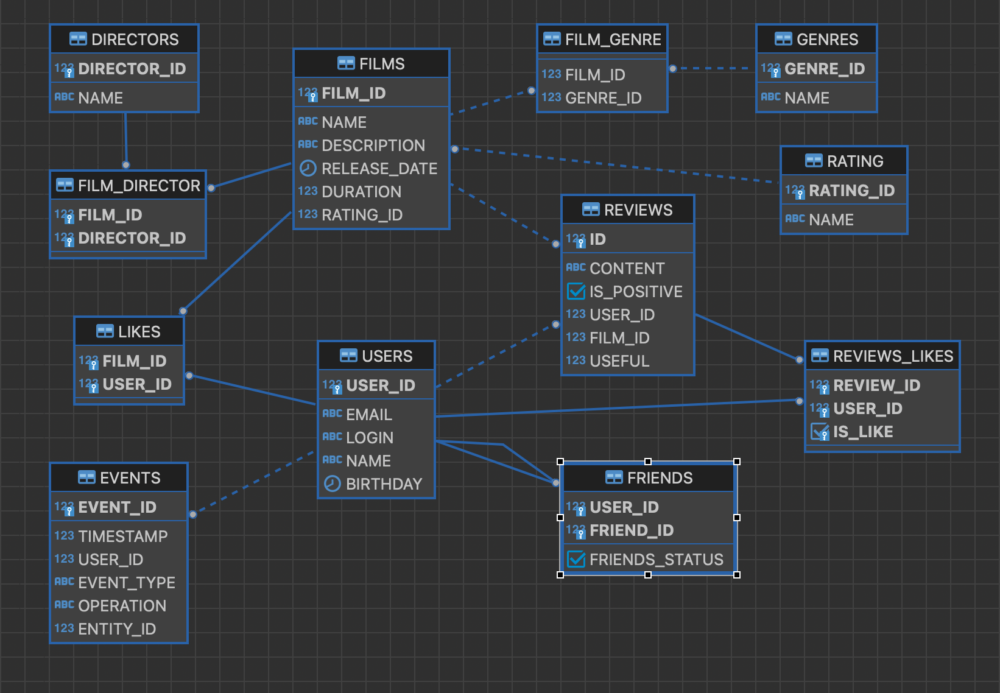

# java-filmorate
Это серверная программа на Java для оценки и поиска фильмов.
##  Функционал
1. Создание и редактирование фильмов.
2. Создание и редактирование учетных записей пользователей.
3. Добавление пользователями в друзья других пользователей.
4. Добавление пользователями лайков фильмам.
5. Просмотр фильмов с наибольшим количеством лайков.
6. Добавление отзывов к фильмам.
7. Просмотр ленты событий пользователя.
8. Просмотр списка фильмов определённого режиссёра.
9. Поиск фильмов по названию или по режиссёру.
10. Поиск общих с другим пользователем понравившихся фильмов.
11. Предоставление рекомендаций, на основе понравившихся пользователю фильмов.
12. Удаление фильмов.
13. Удаление пользователей.
14. Программа предоставляет API для интеграции с другими приложениями.

## API-взаимодействие
Примеры запросов:

1. **Создание пользователя**
   - Эндпоинт: `POST/users`
   - Тело запроса:
   ```
   {
   "login": "yourLogin",
   "name": "your name",
   "email": "mail@mail.ru",
   "birthday": "2000-01-01'
   }
   ```
   - Тело ответа:
   ```
   {
   "id": 1,
   "email": "mail@mail.ru",
   "login": "yourLogin",
   "name": "your name",
   "birthday": "2000-08-20",
   "friends": []
   }
   ```
   
2. **Добавление фильма**
   - Эндпоинт: `POST /films`
   - Тело запроса:
     ```
     {
       "name": "new film",
       "description": "adipisicing",
       "releaseDate": "1967-03-25",
       "duration": 100
     }
     ```
   - Ответ:
     ```
     {
       "id": 1,
       "name": "new film",
       "description": "adipisicing",
       "releaseDate": "1967-03-25",
       "duration": 100,
       "likes": []
     }
     ```

3. **Добавление в друзья**
    - Эндпоинт: `PUT /users/{id}/friends/{friendId}`

4. **Поставить лайк**
    - Эндпоинт: `PUT /films/{id}/like/{userId}`


## ER-диаграмма


ER-диаграмма иллюстрирует сущности и их связи в программе.


1. **films**: Представляет объект фильма. Атрибуты:
   - `film_id`: уникальный идентификатор каждого фильма
   - `name`: название
   - `description`: описание
   - `release_date`: год выхода
   - `duration`: длительность
   - `rating_id`: идентификатор соответствующего рейтинга

2. **rating**: Представляет объект рейтинга. Атрибуты:
   - `id`: уникальный идентификатор каждого рейтинга
   - `name`: название
   - `description`: подробное описание

3. **film_genre**: Представляет соответствие фильма и жанров. Атрибуты:
   - `film_id`: идентификатор фильма
   - `genre_id`: идентификатор соответствующего жанра

4. **genres**: Представляет объект жанра. Атрибуты:
   - `genre_id`: уникальный идентификатор каждого жанра
   - `name`: название

5. **users**: Представляет объект пользователя. Атрибуты:
    - `user_id`: уникальный идентификатор каждого пользователя
    - `email`: адрес электронной почты
    - `login`: логин
    - `name`: имя
    - `birthday`: дата рождения

6. **friends**: Представляет дружеские связи между пользователями. Атрибуты:
    - `user_id`: идентификатор пользователя
    - `friend_id`: идентификатор друга
    - `friends_status`: статус дружбы

7. **likes**: Представляет связь пользователей и понравившихся им фильмов. Атрибуты:
    - `film_id`: идентификатор фильма
    - `user_id`: идентификатор пользователя

8. **events**: Предоставляет объект события в ленте активности пользователя. Атрибуты:
    - `event_id`: идентификатор события
    - `timestamp`: время события
    - `user_id`: идентификатор пользователя
    - `event_type`: тип события
    - `operation`: произведённое действие
    - `entity_id`: идентификатор объекта, связанного с событием
   
9. **directors**: Предоставляет объект режиссёра. Атрибуты
    - `director_id`: идентификатор режиссёра
    - `name`: имя

10. **film-director**: Предоставляет связь фильма и его режиссёров.
    - `director_id`: идентификатор режиссёра
    - `film_id`: идентификатор фильма

11. **reviews**:Предоставляет объект отзыва. Атрибуты
    - `id`: идентификатор отзыва
    - `content`: содержание отзыва
    - `is_positive`: тип отзыва: негативный/положительный
    - `user_id`: идентификатор пользователя
    - `film_id`: идентификатор фильма
    - `useful`: количество оценок полезности отзыва

12. **reviews-likes**:Предоставляет связь отзыва и оценок пользователей. Атрибуты
    - `review_id`: идентификатор отзыва
    - `user_id`: идентификатор пользователя
    - `ìs_like`: оценка отзыва пользователем


Примеры запросов SQL:
1. **Выгрузить все фильмы**
     ```
       SELECT * 
       FROM films;
     ```
2. **Выгрузить всех пользователей**
     ```
       SELECT * 
       FROM users;
     ```
3. **Выгрузить фильм по ID**
     ```
       SELECT * 
       FROM films 
       WHERE id = <film_id>;
     ```
4. **Выгрузить пользователя по ID**
     ```
       SELECT * 
       FROM users 
       WHERE id = <user_id>;
     ```
   
5. **Выгрузить имена пользователей, поставивших лайк определенному фильму**
     ```
       SELECT users.name
       FROM users
       JOIN likes ON users.id = likes.user_id
       WHERE likes.film_id = 5;
     ```
6. **Выгрузить названия пяти самых популярных фильмов и количество лайков**
     ```
       SELECT f.name AS film_name, 
              COUNT(l.film_id) AS like_count
       FROM films AS f
       JOIN likes AS l ON f.id = l.film_id
       GROUP BY f.id
       ORDER BY like_count DESC
       LIMIT 5;
     ```
7. **Выгрузить ID общих друзей**
     ```
       SELECT user2_id  
       FROM friends  
       WHERE friends_status IN ('CONFIRMED') AND user_id = N  
       INTERSECT   
       SELECT user2_id  
       FROM friends  
       WHERE friends_status IN ('CONFIRMED') AND user_id = N2  
     ```
