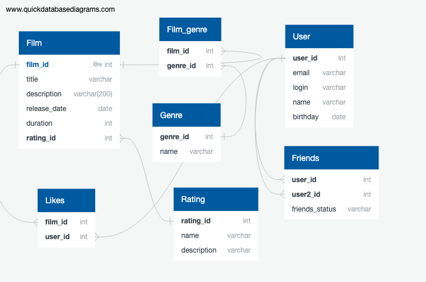

# java-filmorate
Template repository for Filmorate project.

This is a data storage scheme.
Genres and rating are placed separately, as well as the storage of likes and friendships.

## Request examples:
### 1. Unload all users
SELECT *      
FROM user;

### 2. Unload all films
SELECT *
FROM film;

### 3. Unload mutual login friends
SELECT user2_id  
FROM friends  
WHERE friends_status IN ('CONFIRMED') AND user_id = N  
INTERSECT   
SELECT user2_id  
FROM friends  
WHERE friends_status IN ('CONFIRMED') AND user_id = N2  